# Configuración de Vagrant

Para hacer el trabajo más sencillo, crearemos un entorno Vagrant con el cual, añadiendo un script de aprovisionamiento, ahorraremos trabajo a la hora de configurar cada una de las máquinas desde dentro.

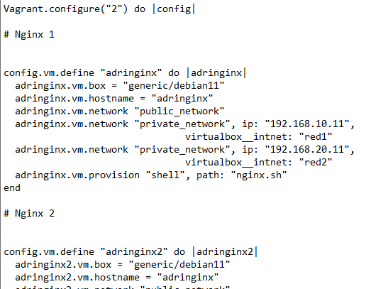

## Configuración de Aprovisionamiento

Los aprovisionamientos usados en cada una de las máquinas son diferentes dependiendo el uso de dicha máquina:
**Servidores Webs Nginx:**

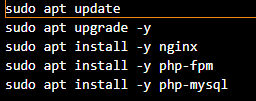

**Servidor Mysql:**

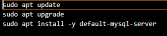

**Balanceador:**

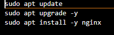

# Configuración Servidores Nginx

***Los siguientes pasos se deberán realizar en ambas máquinas Nginx***

Lo primero que haremos una vez dentro de nuestra máquina Nginx será crear un directorio, en mi caso *sitioweb*.

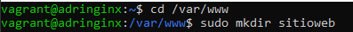

Una vez lo tengamos creado, cambiaremos su dueño y grupo al perteneciente a Nginx para evitar errores de acceso en un futuro.

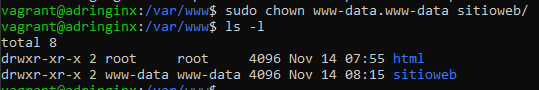

Una vez los preparativos terminados, iremos a la siguiente ruta `/etc/nginx/sites-avalable/` y en ella, con el comando `sudo nano` editaremos el archivo default.
En dicho archivo, cambiaremos la línea `root /var/www/html;` por `root /var/www/sitioweb;` y añadiremos `index.php` seguidamente de index un par de líneas mas abajo.

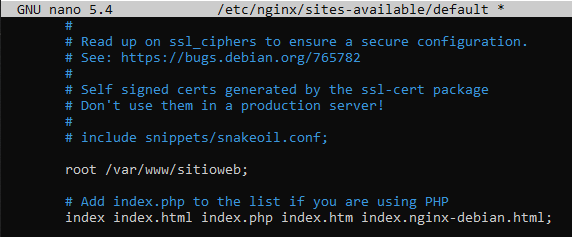

Dentro de ese mismo archivo, descomentaremos las siguientes líneas:

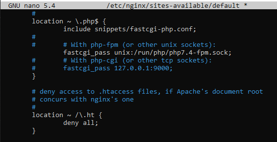

Una vez hecho todo eso, volveremos a `/var/www/sitioweb/` y exportaremos el repositorio GitHub dado en la práctica anterior para facilitar el trabajo con el siguiente comando: `sudo git clone https://github.com/josejuansanchez/iaw-practica-lamp.git` y moveremos el contenido en `iaw-preactia-lamp/src/* a *sitioweb`.
Dentro de config.php modificaremos la dirección IP de "@localhost" por la IP de nuestro servidor Web.

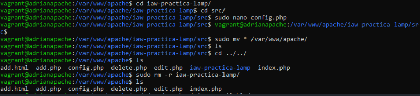
>Imagen de la práctica anterior debido a que me salté este paso en un inicio.

Ahora, modificaremos la directiva `listen` del archivo `/etc/php/7.4/fpm/pool.d/www.conf` con `sudo nano /etc/php/7.4/fpm/pool.d/www.conf` y pondremos `listen = 127.0.0.1:9000` y reiniciaremos el servicio PHP con `sudo systemctl restart php7.4-fpm`

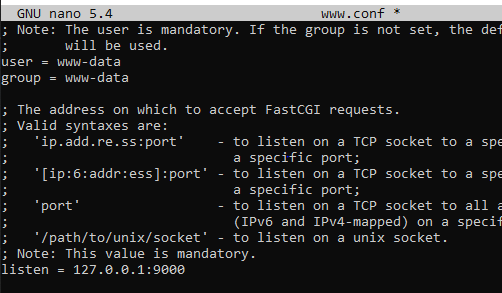

Por último, voleremos a configurar el archivo `/etc/nginx/sites-avalable/default` para que indicarle porue puerto deberá escuchar las peticiones, descomentando la siguiente sección y lo moveremos a `/etc/nginx/sites-avalable/available` eliminando antes el archivo que existia en dicha ruta:

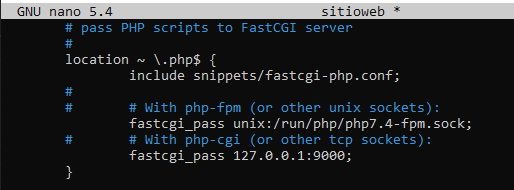

Finalizaremos con un reinicio del servicio Nginx `sudo systemctl restart nginx` y comprobando que funcione correctamente.

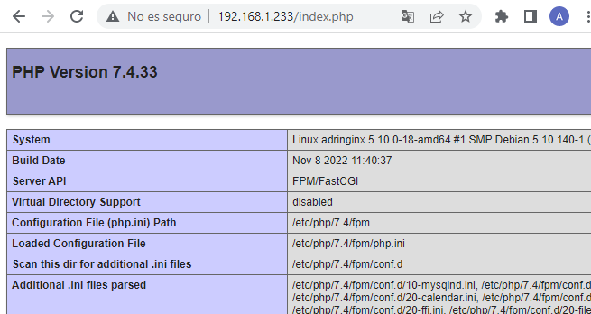

# Configurador Servidor MySQL

En el servidor Mysql, importaremos desde el repositorio Github dado en la práctica, una base de datos y la configuraremos para nuestra red. 

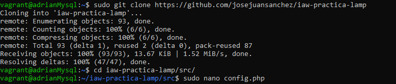

En el archivo `mysql.conf`, cambiaremos la linea de "bind-address 172.0.0.1" por nuestra dirección IP del servidor Mysql.

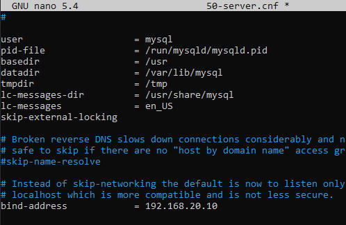

Al haber instalado por aprovisionamiento MySQL, no tendremos contraseña de root. Para ello, pondremos el siguiente comando que nos permitirá configurar dichos parámetros sin tener que volver a instalar MySQL `sudo mysql_secure_installation`.

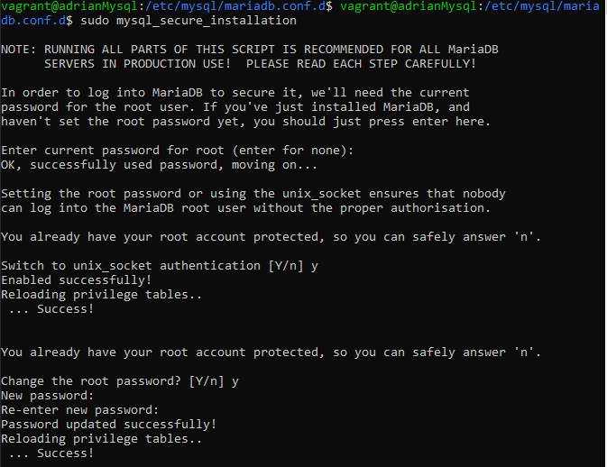

Antes de importar la base de datos a nuestro servidor, eliminaremos las tres ultimas líneas del archivo `iaw-practica-lamp/db/database.sql` para evitar posibles errores al crear un usuario.

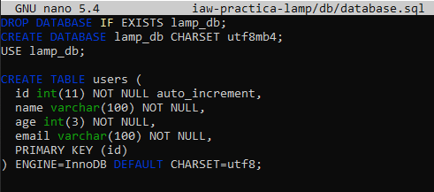

Para finalizar los ajustes de nuestra base de datos, crearemos un usuario al cual le daremos permisos totales a la BD importada previamente.

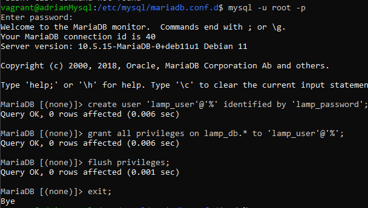

Una vez completado el paso anterior, importaremos la base de datos a muestro MySQL con el siguiente comando `mysql -u root -p < iaw-practica-lamp/db/database.sql`

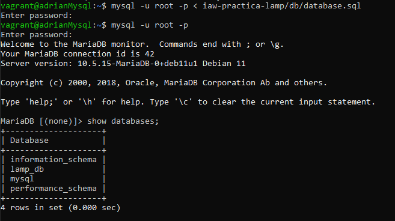

Una vez hecho esto, podemos eliminar el contenido de iaw-practica-lamp.

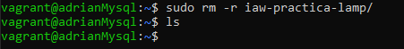

# Configurador máquina Balanceador

Lo único que tendremos que hacer dentro de nuestro Balanceador será la creación del archivo ***balanceador.conf*** dentro de */etc/nginx/conf.d/* con el siguiente contenido:

Una vez hecho esto, ya tendremos nuestro **Balanceador de Carga con Nginx** terminado

