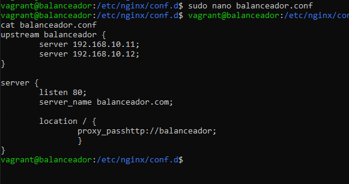

# Configuración de Vagrant

Para hacer el trabajo más sencillo, crearemos un entorno Vagrant con el cual, añadiendo un script de aprovisionamiento, ahorraremos trabajo a la hora de configurar cada una de las máquinas desde dentro.

##Configuración de Aprovisionamiento

Los aprovisionamientos usados en cada una de las máquinas son diferentes dependiendo el uso de dicha máquina:
**Servidores Webs Nginx:**

**Servidor Mysql:**

**Balanceador:**

# Configurador máquina Balanceador

Lo único que tendremos que hacer dentro de nuestro Balanceador será la creación del archivo ***balanceador.conf*** dentro de */etc/nginx/conf.d/* con el siguiente contenido:

Una vez hecho esto, ya tendremos nuestro **Balanceador de Carga con Nginx** terminado

